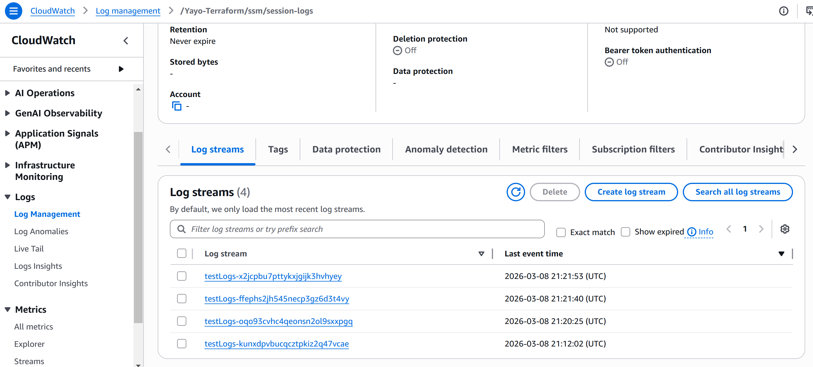

# Failure 03 — Secure Auditable SSM Session Start Failure

I wanted to **implement secure EC2 access through SSM Session Manager** instead of SSH (I am removing SSH).

### Security goals for this design:

- No inbound SSH access
- Access restricted via IAM roles
- Sessions forced through a custom SSM document
- Access limited to tagged instances
- Session activity logged to CloudWatch Logs and encrypted S3

## Errors & Impact

Aaccess to EC2 instances via SSM was unavailable
- Instances appeared offline in SSM
- Session attempts failed for missconfigured IAM SSM start session

## Root Cause

Three configuration issues:

1. **Using AMI without SSM Agent (not all AMI come with SSM agent pre installed)**

2. **Missing Instance Profile Permissions**

Amazon provides a managed policy that enables EC2 service to make the requited actions for SSM Session to work(AmazonSSMManagedInstanceCore)

3. **IAM Policy Conditions Restricting Session Start**

Follow least priviledge principle, ssm:StartSession restricted through IAM policy conditions:

Only a custom SSM document (enforce linux user, logging, IDLE timeout)
Only instances with specific tags accessible

## Fix

1. **Change AMI** used to a version that comes with SSM Agent pre installed

```terraform

# Before
data "aws_ami" "ami_amazon_linux" {
  most_recent = true
  owners      = ["amazon"]

  filter {
    name   = "name"
    values = ["al2023-ami-*-x86_64"]
  }
}

# After
data "aws_ami" "ami_amazon_linux" {
  most_recent = true
  owners      = ["amazon"]

  filter {
    name   = "name"
    values = ["al2023-ami-2023*-x86_64"] 
  }

  filter {
    name   = "architecture"
    values = ["x86_64"]
  }
}
```

2. Add Instance Profile Policy **AmazonSSMManagedInstanceCore**

```terraform
# 1. AWS Managed Policy ARN AmazonSSMManagedInstanceCore 

locals {
  ssm_managed_policy = "arn:aws:iam::aws:policy/AmazonSSMManagedInstanceCore"
}

# 2. Attach SSM policy to the WEB role
resource "aws_iam_role_policy_attachment" "web_ssm_attach" {
  role       = aws_iam_role.web_role.name
  policy_arn = local.ssm_managed_policy
}

# 3. Attach SSM policy to the APP role
resource "aws_iam_role_policy_attachment" "app_ssm_attach" {
  role       = aws_iam_role.app_role.name
  policy_arn = local.ssm_managed_policy
}
```
3. Ensure Correct Instance Tags

```terraform
SSMAccess = app-ops
Environment = <env>
```

## Validation

1.- Correct CLI assume role
```bash
aws sts assume-role `
  --profile AppOps `
  --role-arn arn:aws:iam::<accountID>:role/AppOpsEngineerRole `
  --role-session-name testCW_S3Logs `
  --serial-number arn:aws:iam::<accountID>:mfa/AppOps `
  --token-code XXXXXX
```

2.- Successful session start using custom document:

```bash
aws ssm start-session --target <EC2instanceID> --document-name SSM-AppOpsConfig
```
3.- Session logs recorded in:

- CloudWatch Logs
- Encrypted S3 bucket




# Learning

Secure auditable EC2 access involves three independent layers:

- Instance connectivity (SSM Agent + network 443 port)

- EC2 Instance Profile permissions (managed instance core + log write)

- IAM User + Role permissions (IAM policies and conditions -> Start ssm session)

Failure in any layer prevents session access and logging.