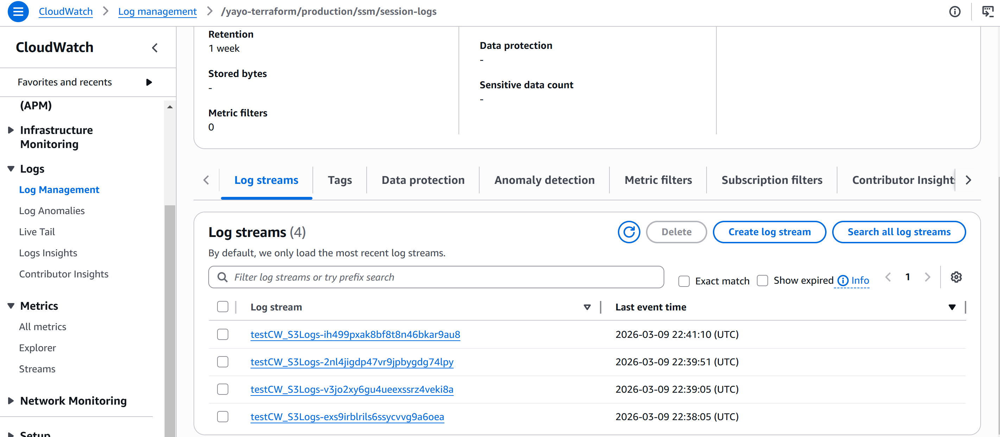
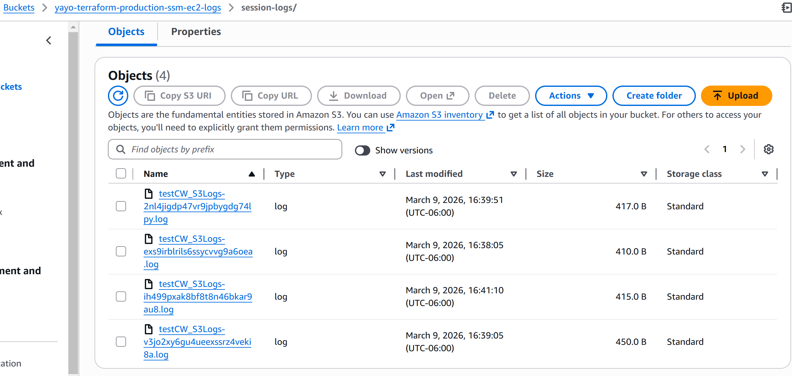

# Logging Root Module

**Purpose:** 
Provision centralized logging infrastructure, used for SSM Session Manager -> visibility and security auditing.

This module prepares the logging backends required for secure EC2 access without SSH, enabling session logs to be stored in both CloudWatch and S3.

## Resources Created

**CloudWatch**
- CloudWatch Log Group for SSM session logs

[](../docs/architecture/CW-SSM-Session-Logs.png)


**S3**

- S3 bucket for long-term SSM session archive

- S3 bucket versioning

- S3 public access block

- S3 server-side encryption (SSE-S3)

- S3 lifecycle rule for log expiration


[](../docs/architecture/S3-SSM-Session-logs.png)

**IAM**

- IAM policy allowing EC2 instances to write session logs

## Design Characteristics

 - ***CloudWatch Logs*** used for short-term operational visibility of SSM sessions

 - ***S3 bucket*** used for longer-term log retention and audit purposes

 - ***Bucket versioning*** enabled to protect audit logs from accidental overwrite

 - ***Public access blocked*** to prevent public acess

 - ***Server-side encryption*** enabled to ensure logs are encrypted

 - ***S3 Lifecycle rule*** removes older logs to control storage costs

 - ***IAM policy*** allow EC2  to write logs to both CloudWatch and S3

## Inputs

Must fill these variable values.

See terraform.tfvars.example and rename or copy to terraform.tfvars

```
cw_retention_days
s3_retention_days
```

## Outputs

 - CloudWatch log group name for SSM session logs

 - S3 bucket ID and ARN used for log archive

 - IAM policy ARN for SSM logging permissions

 - IAM policy JSON used by EC2 instance profiles

## Apply Order
Must be applied **after networking**.

Go to /security/ after this root module

```bash
terraform init
terrafrom plan
terraform apply
```